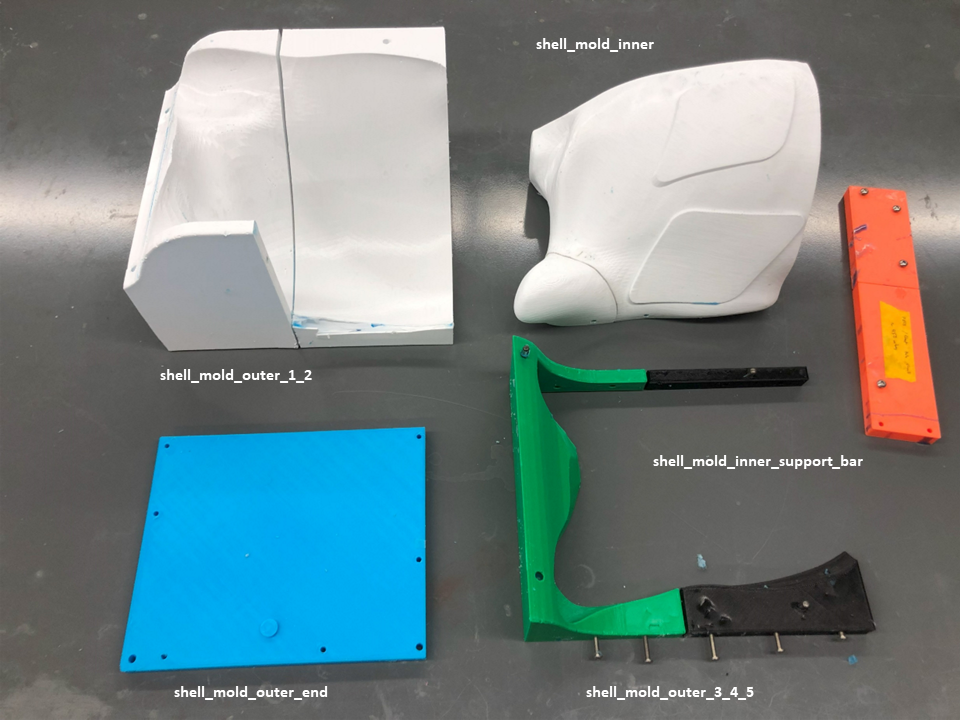
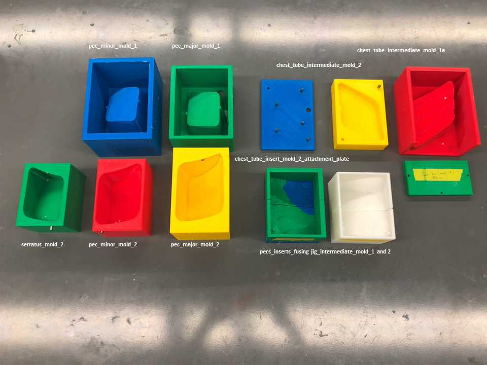
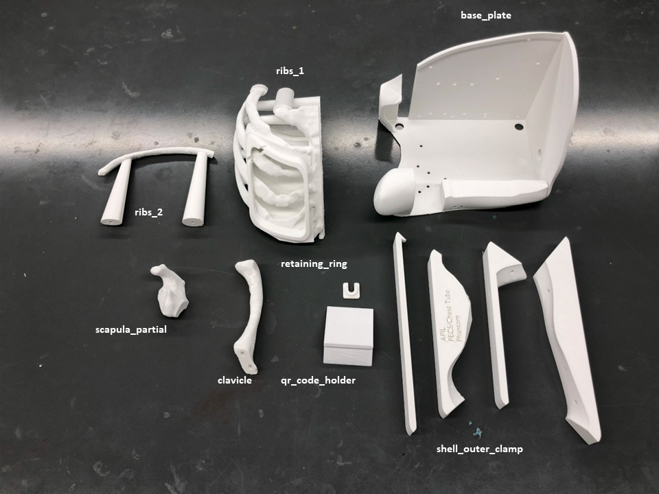
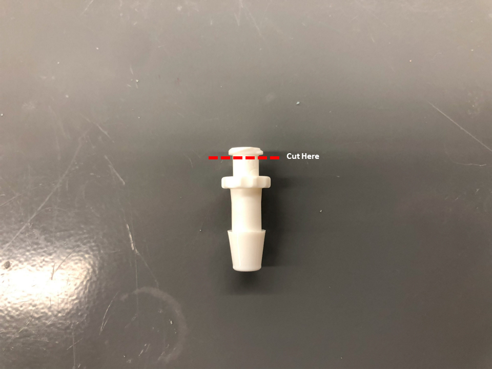
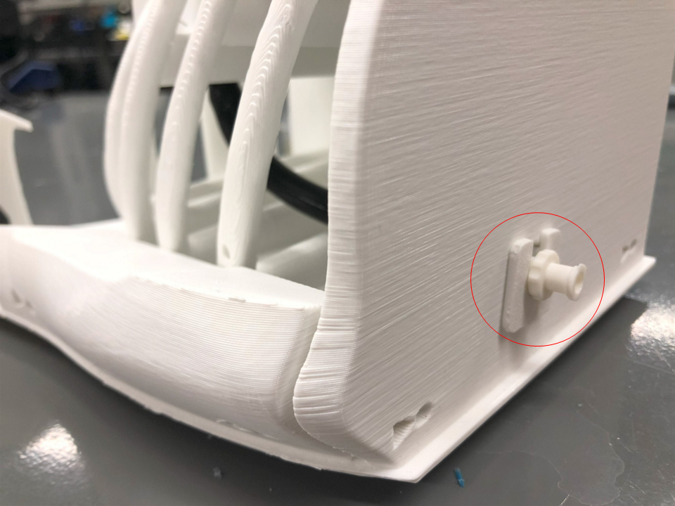

# APIL PECS/Chest Tube Phantom

  

The APIL Pectoralis and Chest Tube Phantom created with a combination of 3D printed structural elements and a series of replacable echogenic gel inserts for each procedure.

The PECS inserts are ultrasoundable and a bolus of liquid can be deposited between the layers to simulate the delivery of an anesthetic agent. Additionally, the chest tube insert is made with a synthetic gel which simulates the tactile feel of human muscle with an additional fabric layer to simulate the pleural membrane.

This model was developed at the [Lynn & Arnold Irwin Advanced Perioperative Imaging Lab](https://apil.ca), Toronto General Hospital, University Health Network.

# Purchasing Information
To purchase this phantom, please email <apil@uhn.ca> and a represtative will be in touch with you with more details.

**A purchased phantom contains the following**:

1. Fully assembled APIL PECS/Chest Tube Phantom
2. 5 x fully assembled echogenic PECS inserts
3. 5 x fully assembled chest tube inserts

# Ultrasound Images
Coming soon

# Care and Maintenance

# Materials & Equipment

## Hardware

- M5x14 Pins
- M5x80 Pins
- Various M4 Screws
- Quick-turn Lock
- 8 mm ID Silicone Tubing (any durometer)
- Tube Fittings 
- Various sized clamps
- Glue gun
- Heat gun
- Nylon mesh fabric (or equivalent)

## Printing Equipment

- Polylactic Acid (PLA)
- Fused Deposition Modelling 3D printer

## Casting Equipment

- Ballistics Gel
  - Gelatin #3 from [Humimic Medical](https://humimic.com/product/gelatin-3-medical-gel-by-the-pound/)
- Graphite Powder
  - used to replicate echogenic scatter of muscle
- Slowcooker
- Two-part Platinum Cure Silicone Rubber (or equivalent)
  - Available from [Smooth-On](https://www.smooth-on.com/products/dragon-skin-30/)
- Degas Chamber (Optional)

# Assembly Instructions

### **Note:** This is a ***very*** complex phantom to manufacture involving a large investment of printer time, filament, silicone, and synthetic gel.

## Printing

This repo includes **stl** files for each printed part.  Several of the more complicated parts also have a **3mf** with support enforcers/blockers in place.  Please ntoe that the **3mf** files replicate the exact printing settings we use for production in the lab using the **Prusa MK3S** as the printer and **PLA** as the filament and may be incompatible other your 3D printers and materials.

In general, we use the following settings for *all* parts of this phantom:

<table>
    <tr>
        <td><b>Material</b></td>
        <td><b>Colour</b></td>
        <td><b>Nozzle Temp (C)</b></td>
        <td><b>Bed Temp (C)</b></td>
        <td><b>Infill (%)</b></td>
        <td><b>Perimiters (#)</b></td>
    </tr>
    <tr>
        <td>PLA</td>
        <td>White</td>
        <td>210.0</td>
        <td>60.0</td>
        <td>10.0</td>
        <td>2</td>
    </tr>
</table>

## Silicone Casting

### Silicone Shell Casting

**NOTE:** We are in the process of updating this mold assembly to make this process much easier.  Currently, this process is extremely difficult.

1. Print all components in the directory */shell_mold_parts/shell_mold_parts/* using the printing settings outlined above.
2. Mix **750 g** of silicone according to manufacturers instructions.
    - Degassing the silicone is encoraged, but optional.
    - Adding colourant to silicone is optional.
3. Pour 3/4 of silicone into the assembled outer mold.
4. Insert the assembled inner mold.
5. Insert necessary M4 bolts around the top rim of mold.
6. Carefully pour remaining 1/4 silicone into the empty spaces of the mold.
7. Allow silicone to cure according to manufacturer's instructions.
8. Carefully disassmble the mold and release the silicone.
   - **NOTE:** This step can be very difficult.  Procede with caution and patience to avoid damaging the silicone shell.

### Silicone PECS and Chest Tube Inserts Molds Casting

1. Print all components in the directory */pecs_chest_tube_inserts_molds/* using the printing settings outlined above.
2. Mix **4000 g** of silicone according to manufacturers instructions.
   1. Cast **1000 g** of mixed silicone into serratus_mold_1 and serratus_mold_2.
   2. Cast **1800 g** of mixed silicone into pecs_minor_mold_1 and pecs_minor_mold_2.
   3. Cast **1200 g** of mixed silicone into pecs_major_mold_1 and pecs_major_mold_2.
3. Assemble chest_tube_intermediate_mold_1a and chest_tube_intermediate_mold_1b using M4 bolts.
4. Mix **1200 g** of silicone according to manufacturers instructions and cast into assembled chest_tube_intermediate_mold_1 and chest_tube_intermediate_mold_2.
5. Allow silicone to cure according to manufacturer's instructions and de-mold silicone molds.

### Silicone PECS Fusion Jig Molds Casting
1. Print all components in the directory */pecs_chest_tube_inserts_molds/pecs_fusion_jig_molds/* using the printing settings outlined above.
2. Assemble pecs_inserts_fusion_jig_intermediate_mold_1a and pecs_inserts_fusion_jig_intermediate_mold_1b using 2 * M5x14 pins.
3. Assemble pecs_inserts_fusion_jig_intermediate_mold_2a and pecs_inserts_fusion_jig_intermediate_mold_2b using 2 * M5x14 pins.
4. Mix **1000 g** of silicone according to manufacturers instructions and cast into assembled pecs_inserts_fusion_jig_intermediate_mold_1 and pecs_inserts_fusion_jig_intermediate_mold_2.
5. Allow silicone to cure according to manufacturer's instructions and de-mold silicone molds.
6. Insert 4 * M5x80 pins into silicone PECS Fusion Jig Molds.

## Ballistics Gel Casting

1. **CAUTION:** Use appropriate heat-proof gloves when working with liquefied ballistic gel and/or heat gun.
2. **CAUTION:** work **only** in a very well ventilated area.  A fumehood is *highly* recommended.

### PECS Inserts Ballistics Gel Casting

1. Melt at least **100 g** gel in crockpot @ 105C - 115C (approx. 225F - 240F).
2. If the gel does not contain graphite powder, slowly add graphite powder into fully liquefied mixture until saturated.
3. Pour approximately **30 g** gel into each of serratus, pecs minor, and pecs major silicone molds from the previous step.
4. Allow gel to fully cool before removal from silicone molds.

### PECS Inserts Fusion

1. Demold gel from serratus, pecs minor, and pecs major molds.
2. Stack each gel layer.
3. Insert stacked gel layers into Fusion Chamber and sandwich between both chamber parts.
4. Set heat gun to **350C** and work your way around the perimiter of stacked gel layers until no gaps are visible.
5. Remove fused insert from jig.  Cut the top-left corner from the insert.  This will create a drain for injected fluids.

### Chest-Tube Inserts Ballistics Gel Casting

1. Melt at least **80 g** gel in crockpot @ 105C - 115C (approx. 225F - 240F).
2. If the gel does not contain graphite powder, slowly add graphite powder into fully liquefied mixture until saturated.
3. Cut-out a rhomboid of nylon mesh approximately the size of the bottom of chest-tube mold.
4. Insert the nylon mesh into the bottom of the silicone chest-tube mold
5. Pour approximately **70 g** gel into silicone chest-tube mold from the previous step.
6. Allow gel to fully cool before removal from silicone molds.

## Phantom Assembly

1. Print all components in the directory */bones/* and */structural_parts/* directories using the printing settings outlined above.
2. Remove all support from printed pieces
3. . Attach scapula_partial and clavicle to back_plate with M4x8 bolts.
4. Cut one end of tube fitting and insert into ribs_1 hole (underneath the PECS insert frame).  Attach with hot glue.

5. Attach 125 mm long silicone tubing to tube fitting.
6. Attach a second tube fitting through hole of back_plate and secure with retaining_plate and hot_glue.  Attach the silicone tubing from step #3 to this tube fitting.

7. Attach ribs_1 and ribs_2 to back_plate with M4x8 bolts
8. Pull silicone shell over assembled structural elements.
9.  Attach all shell_outer_clamp parts around silicone shell and secure with M4 bolts.
